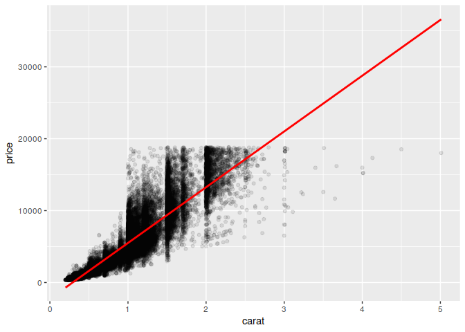
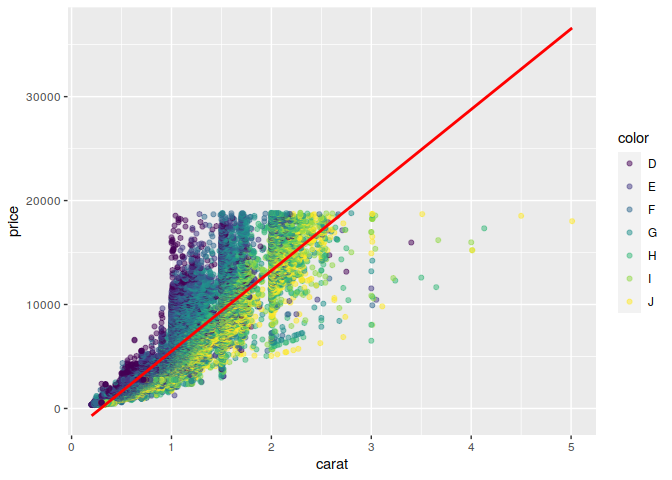
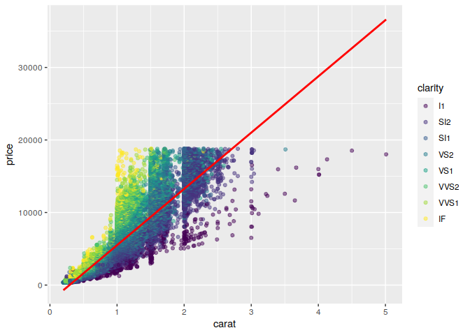
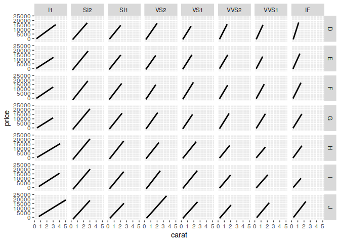

GitHub HW
================

``` r
clean_diamond=ggplot2::diamonds %>%
  filter(
    (color == "D" | color == "G" | color == "J"), 
    (clarity == "I1" | clarity == "VS1" | clarity == "IF")
  ) %>% count(color,clarity)
head(clean_diamond) %>% knitr::kable()
```

| color | clarity |    n |
|:------|:--------|-----:|
| D     | I1      |   42 |
| D     | VS1     |  705 |
| D     | IF      |   73 |
| G     | I1      |  150 |
| G     | VS1     | 2148 |
| G     | IF      |  681 |

[^1]

###Question 2

``` r
ggplot(diamonds, aes(x=carat, y=price))+geom_point(alpha=0.1)+geom_smooth(method="lm", color="red")
```

    ## `geom_smooth()` using formula 'y ~ x'

<!-- -->

There is a positive, moderate strength relationship between carat and
price of diamonds.

[^2]

### Question 3

``` r
ggplot(diamonds, aes(x=carat, y=price, color=color))+geom_point(alpha=0.5)+geom_smooth(method="lm", color="red")
```

    ## `geom_smooth()` using formula 'y ~ x'

<!-- -->

Generally, as the carat increases for all diamond colors, the price does
as well. However, all the diamonds tend to follow this relationship no
matter their color. Diamond color G, H, I, J, E, F all follow the trend
of increasing carats leading to inceeasing price. However, diamond color
D tends to have a higher price at lower carats.

[^3]

### Question 4

``` r
ggplot(diamonds, aes(x=carat, y=price, color=clarity))+geom_point(alpha=0.5)+geom_smooth(method="lm", color="red")
```

    ## `geom_smooth()` using formula 'y ~ x'

<!-- -->

This graph is harder to read as many of the points on the graph are
overlapping so it is hard to see where all the individual points are as
they are all clumped together. However, similar to color, as carat
increases the price does as well for the diamond clarities.

[^4]

### Question 5

``` r
ggplot(diamonds,aes(x=carat, y=price))+geom_smooth(method = "lm", color = "black")+facet_grid(color~clarity)
```

    ## `geom_smooth()` using formula 'y ~ x'

<!-- -->

In general, all the color and clarities of diamonds- no matter how nice
they are- tend to follow a positive trend being as carats increase, so
does the price of the diamonds. The least drastic and gradual increase
in slope happens with the I1 diamonds, and the IF and D combination has
the steepest slope and relationship.

[^5]

###Question 6

``` r
diamonds %>%
  mutate(price_per_carat = price / carat) %>%
  group_by(color, clarity) %>%
  summarize(avg_ppc = mean(price_per_carat, na.rm = TRUE), .groups = "drop") %>% arrange(desc(avg_ppc)) %>% head(10) %>% knitr::kable()
```

| color | clarity |  avg_ppc |
|:------|:--------|---------:|
| D     | IF      | 9937.419 |
| E     | IF      | 5220.976 |
| D     | VVS1    | 4835.817 |
| D     | VVS2    | 4749.577 |
| F     | VVS2    | 4552.218 |
| G     | VVS2    | 4515.093 |
| G     | VS1     | 4420.881 |
| F     | VS1     | 4419.335 |
| I     | SI2     | 4408.040 |
| G     | VS2     | 4405.774 |

The table generally agrees with the plots as I observed D and IF had the
steepest slope with the largest carat price. The table also shows that
the VS diamonds tend to have the lowest price per carat which agrees
with the plots as the VS diamonds have the shortest lines with their
largest carat diamond being the cheapest.

[^6]

[^1]: Question 1 complete

[^2]: Question 2 complete

[^3]: Question 3 complete

[^4]: Question 4 complete

[^5]: Question 5 complete

[^6]: Question 6 complete
